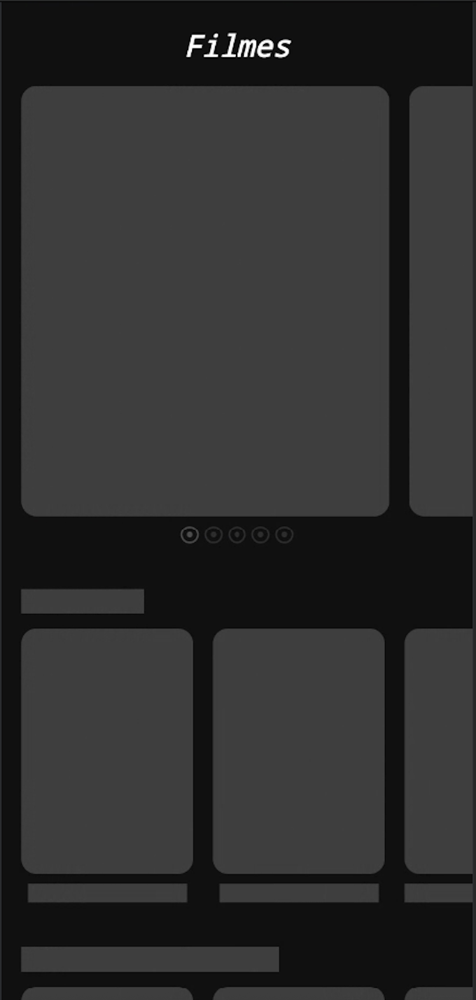
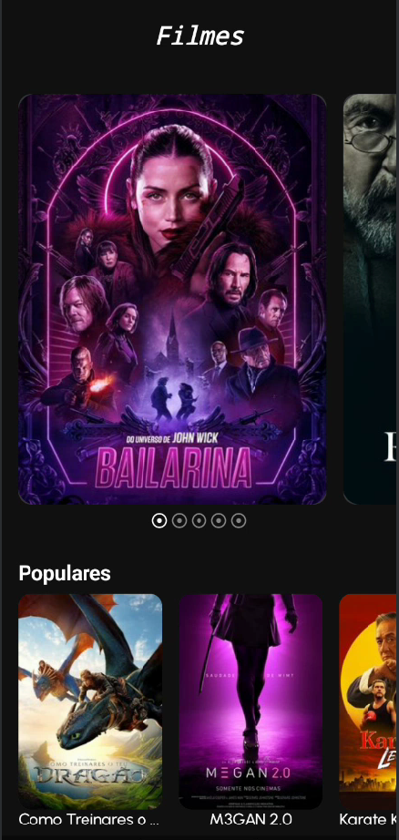

# 🎬 Flickly – Kotlin Multiplatform App (Compose Multiplatform)

A modern multiplatform movie discovery app, built using the [The Movie Database (TMDb)](https://www.themoviedb.org/) API. Developed with **Kotlin Multiplatform** and **Compose Multiplatform (CMP)**, this project showcases best practices in architecture, shared business logic, and declarative UI.

---

<div align="center">
  <div style="display: flex; gap: 10px; justify-content: center; flex-wrap: wrap;">
    
    
    
  </div>
</div>

---

## 🚀 Getting Started

### 📋 Prerequisites

| Tool | Minimum version | Notes |
|------|----------------|-------|
| JDK | 21 | Required by Gradle |
| Android Studio | Hedgehog+ | With KMP plugin |
| Xcode | 16.0+ | iOS builds only |
| CocoaPods | 1.16+ | `sudo gem install cocoapods` |
| Kotlin | 2.3.0 | Managed by Gradle |
| Compose Multiplatform | 1.10.0 | Managed by Gradle |

---

### 🔑 API Key Setup (required for both platforms)

This project uses the [TMDb API](https://www.themoviedb.org/settings/api). You need a free **Read Access Token (v4 auth)**.

1. Create an account at [themoviedb.org](https://www.themoviedb.org/signup)
2. Go to **Settings → API** and generate a token
3. Configure it per platform as described below

> ⚠️ Never commit your token. All secret files are already in `.gitignore`.

---

### 🤖 Android Setup

Add your token to `local.properties` in the **root** of the project (create the file if it doesn't exist):

```properties
# local.properties
sdk.dir=/path/to/your/Android/sdk
TMDB_ACCESS_TOKEN=your_token_here
```

Then open the project in **Android Studio** and run the `app` target.

---

### 🍎 iOS Setup

iOS requires a few extra steps after cloning.

#### 1. Install CocoaPods (if not already installed)

```bash
sudo gem install cocoapods
```

Verify the installation:

```bash
pod --version  # should be 1.16+
```

#### 2. Create `Secrets.xcconfig`

Create the file `iosApp/iosApp/Configuration/Secrets.xcconfig` with your token:

```bash
mkdir -p iosApp/iosApp/Configuration
echo "TMDB_ACCESS_TOKEN=your_token_here" > iosApp/iosApp/Configuration/Secrets.xcconfig
```

> This file is in `.gitignore` and will **never** be committed.

#### 3. Add Firebase config

Copy your `GoogleService-Info.plist` (from [Firebase Console](https://console.firebase.google.com)) to:

```
iosApp/iosApp/GoogleService-Info.plist
```

> Also in `.gitignore` — never commit this file.

> ⚠️ Make sure the `GoogleService-Info.plist` contains the `STORAGE_BUCKET` key. If it is missing, download a fresh copy from the Firebase Console (Project Settings → Your Apps → iOS) or add it manually:
> ```xml
> <key>STORAGE_BUCKET</key>
> <string>your-project-id.firebasestorage.app</string>
> ```

#### 4. Install CocoaPods dependencies

```bash
cd iosApp
pod install
```

`pod install` will automatically:
- Install all pods (Firebase, YouTubePlayerKit, AppMan KMP framework, etc.)
- Inject `TMDB_ACCESS_TOKEN` from `Secrets.xcconfig` into the generated build settings
- Configure `JAVA_HOME` for the KMP Gradle sync phases

> ⚠️ If you see `Unable to locate a Java Runtime` during `pod install`, make sure JDK 21 is installed:
> ```bash
> # Using Homebrew
> brew install --cask temurin@21
>
> # Or using SDKMAN
> sdk install java 21-tem
> ```
> Then run `pod install` again.

#### 5. Open the workspace (not the `.xcodeproj`!)

```bash
# From the iosApp/ directory
open iosApp.xcworkspace
```

> ⚠️ Always use **`iosApp.xcworkspace`**, never `iosApp.xcodeproj` directly — CocoaPods requires the workspace.

#### 6. Build & Run

Select a simulator or device in Xcode and press **⌘R**.

The first build will take longer — Gradle needs to compile the KMP framework (`AppMan`) for iOS.

---

#### 🔁 Full iOS setup from scratch (copy & paste)

```bash
# 1. From project root — create Secrets.xcconfig
mkdir -p iosApp/iosApp/Configuration
echo "TMDB_ACCESS_TOKEN=your_token_here" > iosApp/iosApp/Configuration/Secrets.xcconfig

# 2. Copy GoogleService-Info.plist to:
#    iosApp/iosApp/GoogleService-Info.plist  (do this manually from Firebase Console)

# 3. Install pods
cd iosApp
pod install

# 4. Open workspace
open iosApp.xcworkspace
```

---

### ⚠️ Common iOS Issues

| Error | Cause | Fix |
|-------|-------|-----|
| `401 Unauthorized` from TMDb | `Secrets.xcconfig` missing or token wrong | Check step 1 above |
| `Unexpectedly found nil` on `FirebaseApp.app()` | `FirebaseApp.configure()` not called | Ensure `iOSApp.swift` calls `FirebaseApp.configure()` before `startKoinIfNeeded()` |
| `No default Storage bucket found` | `STORAGE_BUCKET` missing in `GoogleService-Info.plist` | Add `STORAGE_BUCKET` key (check step 3 above) or re-download plist from Firebase Console |
| `Unable to locate a Java Runtime` | Xcode can't find JDK | Ensure JDK 21 is installed and JAVA_HOME is set; run `pod install` again to reinject |
| `Framework 'AppMan' not found` | KMP framework not compiled | Run `pod install` or build once from terminal: `./gradlew :app:syncFramework ...` |
| `66 duplicate symbols` | `Core` pod added alongside `AppMan` | Remove `pod 'Core'` — it's already exported by `AppMan` |
| Opening `.xcodeproj` instead of `.xcworkspace` | CocoaPods not integrated | Always open `iosApp.xcworkspace` |

---

## ⚙️ Clean Architecture

The project follows **Clean Architecture** principles, enabling low coupling, high cohesion, and testability:

```
├── data/ → Repositories, data sources (remote and local)
├── domain/ → Use Cases and business entities
├── ui/ → UI layer (Compose), ViewModels and UI states
├── di/ → Dependency injection modules
└── utils/ → Helpers, configuration, and reusable extensions
```


---

## 🧰 Technologies and Tools

### 🛠️ Core Technologies

- **Kotlin Multiplatform (2.2.0)** – Shared codebase between Android and iOS
- **Compose Multiplatform (1.8.2)** – Unified declarative UI
- **Gradle Version Catalogs** – Centralized dependency management via `libs.versions.toml`

### 📱 Supported Targets

- **Android**: `minSdk = 24`, `targetSdk = 35`
- **iOS**: Kotlin/Native with SwiftUI integration

---

## 🔌 Libraries Used

### 📡 Networking

- `ktor-client-core`
- `ktor-client-okhttp`
- `ktor-client-darwin`
- `ktor-content-negotiation`
- `ktor-serialization-json`

### 🧪 Dependency Injection

- `koin-core`
- `koin-compose`
- `koin-compose-viewmodel`

### 🧠 State Management & Lifecycle

- `androidx.lifecycle-viewmodel`
- `lifecycle-viewmodel-compose`

### 🔀 Navigation

- `androidx.navigation-compose`

### 🖼️ Image Loading

- `coil-compose`
- `coil-network-ktor3`

### 🧾 Serialization

- `kotlinx-serialization-json`

### ⚙️ Utilities

- `kotlinx-coroutines-core`
- `kotlinx-datetime`
- `collections-immutable`
- `lyricist` (i18n for Compose)

---

## 🧱 Patterns & Best Practices

- **Clean Architecture**: clear separation of concerns
- **MVVM + MVI**: unidirectional data flow and immutable UI states
- **Repository Pattern**: abstracts data sources for testability
- **Koin DI**: modular and lightweight dependency injection
- **Centralized Error Handling**: handles `loading`, `success`, and `error` states consistently

---

## 🌐 API Integration – The Movie Database (TMDb)

### 🔗 HTTP Configuration

```kotlin
internal enum class HttpConfig(val value: String) {
    BASE_URL("https://api.themoviedb.org"),
    IMAGE_BASE_URL("https://image.tmdb.org/t/p"),
    LANGUAGE("language"),
}
```

## 📦 Implemented Features
* 🔍 Movie search

* 🎞️ Popular movies list

* 📄 Movie details screen

* ⚡ Optimized image caching using Coil

## 🧪 Testing
### 🔧 Frameworks
* kotlin-test

* junit

* androidx-testExt-junit

### 🧬 Test Strategy
* Unit tests for use cases

* Integration tests for repositories

* UI tests for Compose components (WIP)

## 🗂️ Project Structure
```
composeApp/
├── src/
│   ├── androidMain/          → Android-specific code
│   ├── iosMain/              → iOS-specific code (Kotlin/Native)
│   ├── commonMain/           → Shared logic across platforms
│   │   ├── kotlin/           → Shared application code
│   │   └── composeResources/ → Shared UI resources (strings, colors)
│   └── commonTest/           → Shared tests
```

### 🚀 Technical Highlights
* 🔄 Kotlin Multiplatform: maximum code reuse

* 🧼 Clean Code: maintainable and SOLID-compliant architecture

* ⚛️ Compose Multiplatform: modern UI with reactivity and performance

* 🧩 Version Catalogs: centralized dependency versioning

* 🧪 Detekt: static code analysis for quality assurance

* 🧠 Coroutines + Flow: asynchronous reactive logic

* 🌍 Lyricist: modern i18n integration in Compose

### 📚 Learnings and Purpose
This project aims to:

* Solidify knowledge in KMP and CMP

* Apply and validate Clean Architecture in real scenarios

* Serve as a technical portfolio for interviews and code review

* Validate and explore modern Kotlin ecosystem libraries

### 🔮 Next Steps
* Local database support ( SQLDelight)

* Logging: User's favorite movie

* Favorites feature with persistence layer

* Make a designer system
  
* Test A/B with firebase or analytics 

## 🤝 Contribuindo

Contribuições são bem-vindas! Para garantir a qualidade e consistência do projeto, siga as diretrizes abaixo ao abrir um Pull Request:

### ✅ Requisitos para aprovação de PR

- O PR **deve conter a label** `internal`
- Deve haver **pelo menos um assignee** atribuído
- Deve incluir **testes relevantes** para qualquer nova funcionalidade ou correção
- O código precisa seguir os padrões de formatação definidos pelo projeto (ex: Detekt)
- Commits devem ser claros e descritivos

### 🧪 Antes de abrir um PR

- Rode todos os testes locais com `./gradlew allTests`
- Garanta que o projeto compila para todos os targets (`android`, `ios`)
- Verifique se não há conflitos com a branch `main`

---

Se você está apenas explorando o projeto ou deseja discutir uma nova feature, sinta-se à vontade para abrir uma *issue* antes do PR.
